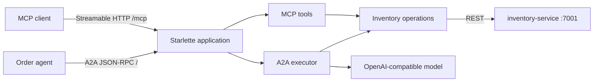

# inventory-agent

This app exposes standards-compliant agent interfaces for the optional agents feature.

It provides:

- An MCP server over streamable HTTP at `/mcp`
- An A2A server with agent card discovery at `/.well-known/agent-card.json`
- A2A JSON-RPC endpoint at `/`
- Health endpoint at `/health`

The service delegates all state changes to `inventory-service`.

## Architecture and request flow

The service exposes two agent protocols from one Python process:



### Starlette

[Starlette](https://www.starlette.io/) is the ASGI web framework that hosts all HTTP interfaces. Uvicorn runs the Starlette `app`, which combines:

- `/health` for service health
- `/mcp` for the mounted FastMCP streamable HTTP application
- `/.well-known/agent-card.json` for A2A discovery
- `/` for A2A JSON-RPC requests

The Starlette lifespan handler starts and stops the MCP session manager with the application.

### MCP interface

[Model Context Protocol (MCP)](https://modelcontextprotocol.io/) exposes focused inventory operations as discoverable tools. `FastMCP` derives each tool's input schema from its Python function signature and type annotations.

The available tools are:

- `mcp_check_stock`
- `mcp_reserve_stock`
- `mcp_create_reorder_proposal`
- `mcp_get_reorder_proposal`

An MCP client connects to `/mcp`, lists the tools, and invokes the operation it needs. These tools call the inventory functions directly and do not involve the language model.

### A2A interface

[Agent2Agent (A2A)](https://a2a-protocol.org/) exposes the service as a task-oriented inventory agent. The public agent card advertises the `assess_order_inventory` skill, supported input and output modes, streaming support, and the JSON-RPC endpoint.

For an order assessment request, the A2A flow is:

1. The A2A request handler creates or resumes an in-memory task.
2. `InventoryA2AExecutor` marks the task as submitted and working.
3. The Agent Framework agent sends the order to the configured model.
4. The model calls the local `process_order_inventory` tool.
5. The tool reserves each order item through `inventory-service` and collects any reorder proposal IDs.
6. The executor returns the JSON result and marks the A2A task complete.

If the model fails or does not produce a valid tool result, the executor calls `process_order_inventory` directly. This deterministic fallback supports local models with limited tool-calling behavior.

The A2A agent does not call its own MCP endpoint. MCP and A2A are separate interfaces over the same underlying inventory functions. A2A uses the higher-level `process_order_inventory` workflow, while MCP exposes the individual operations.

Task state uses `InMemoryTaskStore`, so task history is lost when the process restarts.

## Authentication options for the model client

The agent supports both:

- API key auth (`OPENAI_API_KEY` path)
- Passwordless auth (`USE_WORKLOAD_IDENTITY_AUTH=true` path)

For local OpenAI-compatible endpoints (Ollama/vLLM), set `OPENAI_API_KEY=none`.

## Prerequisites

- [Python 3](https://www.python.org/downloads/)
- [uv](https://docs.astral.sh/uv/)
- `inventory-service` running at `http://127.0.0.1:7001`
- OpenAI-compatible model endpoint for Agent Framework (for example Ollama or Foundry)

## Running the app locally

Open a terminal in `src/inventory-agent` and run:

```bash
uv sync

export INVENTORY_SERVICE_URL=http://127.0.0.1:7001
export INVENTORY_AGENT_PUBLIC_BASE_URL=http://127.0.0.1:7002
export OPENAI_BASE_URL=http://127.0.0.1:11434/v1
export OPENAI_CHAT_MODEL=gpt-oss:20b
export OPENAI_API_KEY=none
export USE_WORKLOAD_IDENTITY_AUTH=false
uv run uvicorn main:app --host 127.0.0.1 --port 7002
```

For passwordless Azure auth, set:

```bash
export USE_WORKLOAD_IDENTITY_AUTH=true
export AZURE_OPENAI_ENDPOINT=https://<your-azure-openai-resource>.openai.azure.com/
export AZURE_OPENAI_CHAT_MODEL=<deployment-name>
export AZURE_OPENAI_API_VERSION=2024-12-01-preview
```

## Running with Docker Compose

The `docker-compose.yml` in this directory starts `inventory-service` and `inventory-agent` together.

```bash
# Start without telemetry
docker compose up --build

# Start with the LGTM telemetry stack (Grafana at http://localhost:3000)
ENABLE_INSTRUMENTATION=true docker compose --profile telemetry up --build

# Stop all services (including telemetry stack)
docker compose --profile telemetry down
```

> **Note:** On Linux, Ollama must bind to all interfaces (`OLLAMA_HOST=0.0.0.0 ollama serve`) so the
> container can reach it via `host.docker.internal`.

## Manual testing

Use `test-inventory-agent.http` with the VS Code REST Client extension, or use the `curl` commands below.

### 1. Health check

```bash
curl http://localhost:7002/health
```

### 2. Agent card

Inspect the agent's capabilities and skill definitions:

```bash
curl -s http://localhost:7002/.well-known/agent-card.json | jq
```

### 3. Inventory service baseline

Confirm the upstream data is present before involving the agent:

```bash
# Check stock for product 1
curl http://localhost:7001/inventory/1

# List existing reorder proposals
curl http://localhost:7001/proposals
```

### 4. A2A: assess order inventory

The agent speaks the A2A protocol (v1.0) at `POST /`. Important protocol details:

- Method: `SendMessage` (sync) or `SendStreamingMessage` (SSE)
- Header: `A2A-Version: 1.0` required — omitting it defaults to v0.3 and returns an error
- Role: `ROLE_USER` (protobuf enum, not `"user"`)
- Parts: `{"text": "..."}` directly (no `kind` wrapper)
- `messageId` is required

```bash
curl -s http://localhost:7002/ \
  -H "Content-Type: application/json" \
  -H "A2A-Version: 1.0" \
  -d '{
    "jsonrpc": "2.0",
    "id": "1",
    "method": "SendMessage",
    "params": {
      "message": {
        "messageId": "msg-001",
        "role": "ROLE_USER",
        "parts": [{"text": "{\"orderId\":\"order-123\",\"correlationId\":\"corr-1\",\"items\":[{\"productId\":1,\"quantity\":2,\"price\":10.0}]}"}]
      }
    }
  }' | jq
```

A successful response has `status.state = "TASK_STATE_COMPLETED"` and the agent reply in `history[1].parts[0].text`.

### 5. MCP tools

The agent exposes its tools as an MCP server at `/mcp`. Requires `Accept: application/json, text/event-stream`.

```bash
# List available tools
curl -s -X POST http://localhost:7002/mcp \
  -H "Content-Type: application/json" \
  -H "Accept: application/json, text/event-stream" \
  -d '{"jsonrpc":"2.0","id":"1","method":"tools/list"}' | jq

# Call check_stock directly (bypasses the LLM)
curl -s -X POST http://localhost:7002/mcp \
  -H "Content-Type: application/json" \
  -H "Accept: application/json, text/event-stream" \
  -d '{"jsonrpc":"2.0","id":"2","method":"tools/call","params":{"name":"mcp_check_stock","arguments":{"product_id":1}}}' | jq
```

### 6. Telemetry (when running with the telemetry profile)

Open Grafana at **<http://localhost:3000>** (no login required). Allow 15-30 seconds after sending requests for data to appear.

**Viewing traces in Tempo:**

1. Click **Explore** (compass icon in the left sidebar)
2. Select **Tempo** from the datasource dropdown
3. Set query type to **Search**
4. Set **Service Name** to `inventory-agent`
5. Click **Run query** to list recent traces
6. Click any trace to open the span waterfall view
7. Click the log icon on a span to jump to correlated Loki logs

A healthy trace shows an `invoke_agent Inventory Agent` span containing two child `chat gpt-oss:20b` spans (one for tool selection, one for response) and an `execute_tool process_order_inventory` span in between.

**Querying logs in Loki:**

1. Click **Explore** and select **Loki**
2. Use the query: `{service_name="inventory-agent"}`
3. Set the time range to **Last 15 minutes** and click **Run query**

**Querying metrics in Prometheus:**

1. Click **Explore** and select **Prometheus**
2. Query `gen_ai_client_token_usage_bucket` for LLM token usage
3. Query `http_server_request_duration_seconds_bucket` for request latency

> **No data?** The most common cause is `ENABLE_INSTRUMENTATION` not being set. Confirm with
> `docker compose exec inventory-agent env | grep ENABLE` -- it must show `ENABLE_INSTRUMENTATION=true`.
> Also confirm the time range in Grafana is set to **Last 15 minutes** or shorter.

## Testing with scripts

Run an A2A smoke test:

```bash
uv run python scripts/test_a2a.py
```

Run a parameterized A2A test (optional):

```bash
uv run python scripts/test_a2a.py --base-url http://127.0.0.1:7002 --product-id 1 --quantity 2
```

Inspect MCP tools with MCP Inspector:

```bash
npx -y @modelcontextprotocol/inspector --web --transport http --server-url http://127.0.0.1:7002/mcp
```
